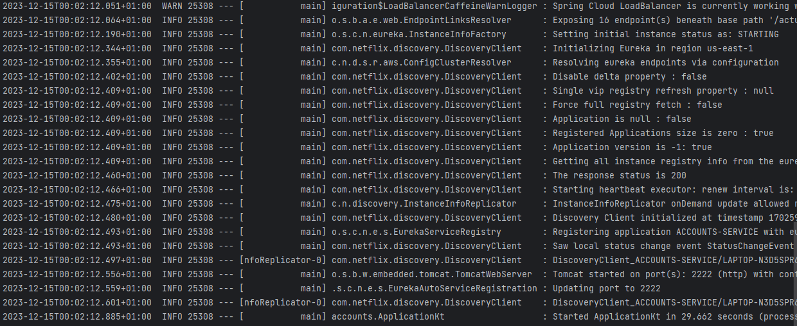
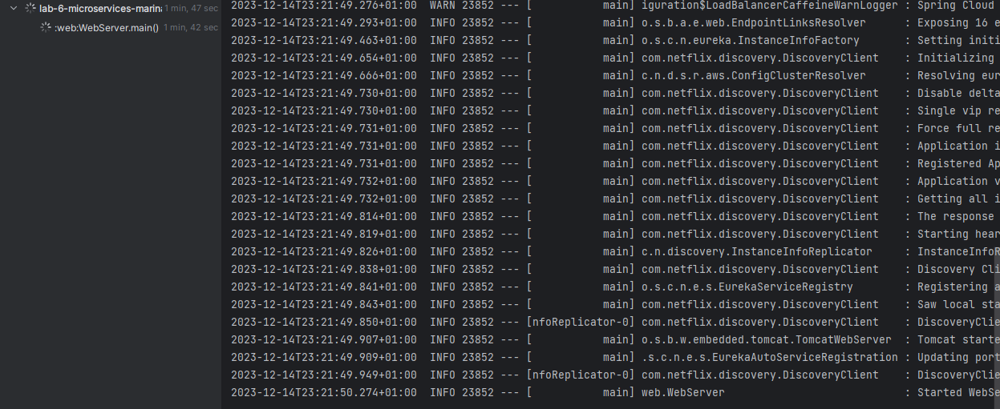
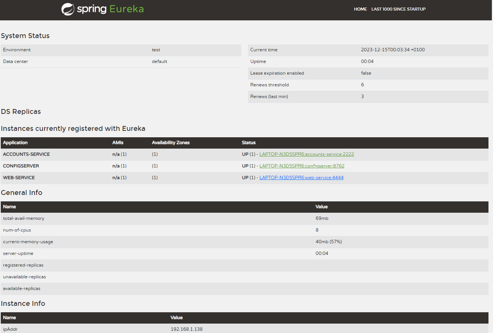
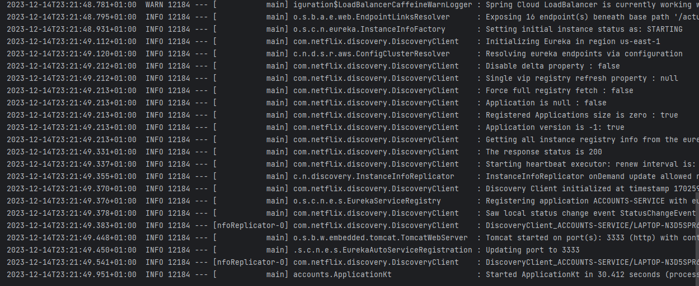
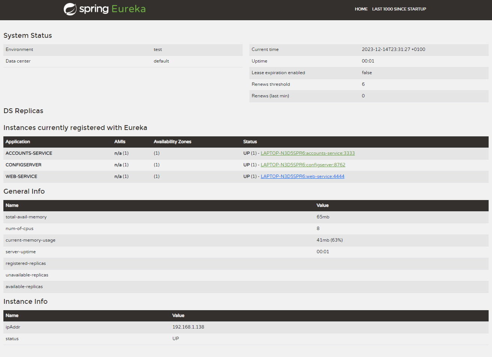
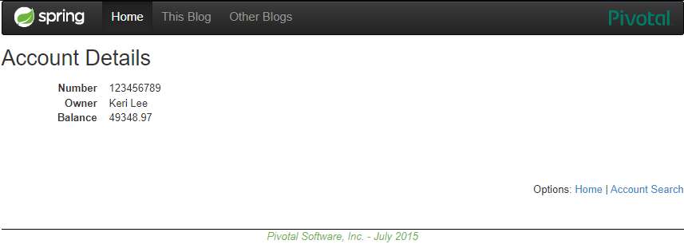

# REPORT.MD

## Create your own configuration repository
The configuration repository is located in <https://github.com/marinalamiel/lab6-microservices-config-repo.git>
## Two services are running and registered


## Eureka dashboard
Here is a screenshot of the Eureka dashboard with the two services registered:
As we can see, the two services are registered and running. The accounts service is 
running in the port 2222 and the web service is running in the port 4444.


## Update the configuration repository
Now we are going to update the configuration repository so that the accounts service
uses the port 3333.

The commit is located in:
https://github.com/marinalamiel/lab6-microservices-config-repo/commit/9db00a5ba0f1f72f52a1d835cbecaf7391a98ff5
## Run a second instance of the accounts service
To run a second instance of the accounts service using the new configuration, we have
to run in a new console the following command:
```bash
  ./gradlew accounts:bootRun
```


## Killing the service accounts (2222) and do requests to web
When we kill the service accounts (2222) and do requests to web.
You can see that in Eureka it has been instantly removed.


## Can the web service provide information about the accounts again?
Yes, the web service can provide information about the accounts again. This is because
the web service is registered in Eureka and it can find the accounts service in the port 3333.

